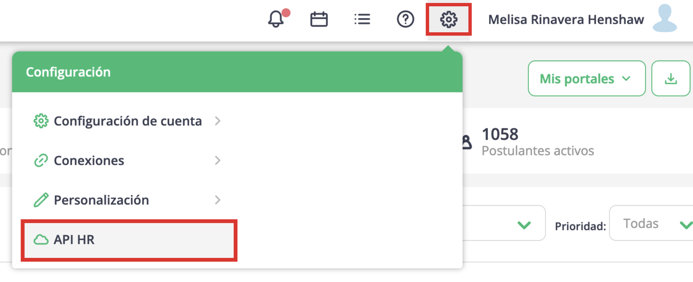
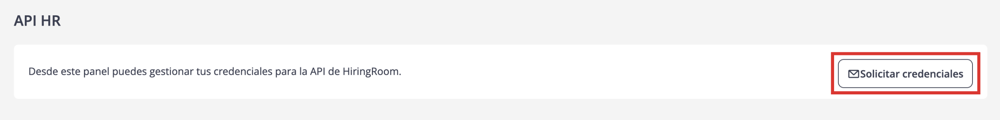

# Hiring Room API
## Contenido

- [Introducción](#introducción)
  - [Habilitar credenciales](#habilitar-credenciales)
- [Interfaz swagger](#interfaz-swagger)
- [Inicio de Sesión](#inicio-de-sesión)
- [Creación de una vacante](#creación-de-una-vacante)
- [Publicar una vacante y obtener postulantes](#publicar-una-vacante-y-obtener-postulantes)
- [Manejo de errores](#manejo-de-errores)

## Introducción

Para comenzar, además de las credenciales habituales para acceder a HiringRoom (nombre de usuario y contraseña),
el cliente debe obtener las credenciales necesarias para interactuar con la API: **client_id** y **client_secret**.
Estas credenciales pueden generarse y visualizarse directamente desde la plataforma HiringRoom.

El nombre de usuario (username) y la contraseña (password) se utilizan para autenticar a un usuario específico al
conectarse por medio de nuestra API. Todas las acciones realizadas a través de la API en nombre de este usuario estarán
asociadas a su cuenta. Se recomienda que este usuario tenga privilegios de administrador, ya que los usuarios con
permisos más limitados podrían no tener acceso a ciertos endpoints.

La **API de HiringRoom** (API-HR) cuenta con una interfaz Swagger, la cual permite visualizar y probar los distintos
endpoints disponibles. Esta interfaz se encuentra en: https://api.hiringroom.com/.

### Habilitar credenciales
El **client_id** y el **client_secret** son esenciales para interactuar con la API, ya que sin ellos no se puede generar
el `access_token` requerido por los endpoints. 

Para obtener estas credenciales, sigue los siguientes pasos:

1. Inicia sesión en tu cuenta de HiringRoom con tu usuario administrador.

2. Navega a Configuración -> **API HR**.


3. Una vez dentro de las preferencias del sistema nos dirigimos a **Integración API HR** y hacemos click en **Solicitar credenciales**. Obtendremos un Json con las credenciales


4. Copiar y almacenar de forma segura estas credenciales.
   ```json
    {
        "client_id" : "[CLIENT_ID]",
        "client_secret" : "[CLIENT_SECRET]"
    }
   ```

Nota: Una vez obtenidas las credenciales deben ser almacenadas en algún lugar de confianza. Una vez fuera de esa vista,
o si se refresca la página, las credenciales no serán visibles nuevamente, debiendo repetir el proceso para adquirirlas
nuevamente. **Se debe tener en cuenta que si se adquieren nuevas credenciales, las anteriores dejarán de ser válidas**. 


# Interfaz swagger

Una pequeña explicación de la interfaz para entender como funciona:

- Estructura básica


- Ejemplo modelo de response code 200


- Ejemplo de response de algun endpoint


## Inicio de Sesión

1. Desplegar el apartado **autenticacion-usuarios**. El endpoint a usar es **POST /authenticate/login/users**
2. Completar el body con la información requerida:
    ```json
    {
      "grand_type": "password",
      "client_id": "[CLIENT_ID]",
      "client_secret": "[CLIENT_SECRET]",
      "username": "[EMAIL]",
      "password": "[PASSWORD]"
    }
   ```
   Donde:
   - **CLIENT_ID**: es el client_id previamente obtenido.
   - **CLIENT_SECRET**: es el client_secret previamente obtenido.
   - **EMAIL**: es el email del usuario de HiringRoom que quiere conectar vía API.
   - **PASSWORD**: es el password del usuario de HiringRoom que quiere conectar vía API.
   
3. Hacer click en el botón **Try it out!**.
4. La respuesta será un json con el siguiente:
    ```json
        {
         "token": "eyJhbGciOiJIUzI1NiIsInR5cCI6IktaXNlbnRyZXZpc3RhcyIsInNjcCI6WyJ1c2VyczpyZWFkIiwicG9zdHVsYW50czpyZWFkIiwicG9zdHVsYW50czp3cml0ZSIsInZhY2FuY2llczpyZWFkIiwidmFjYW5Njb3VudF9sb2NhbGl0aWVzOnJlYWQiLCJhY2NvdW50X2xvZ29zOnJlYWQiLCJhY2NvdW50X3N0YWdlczpyZWFkIiwiY29tdW5lczpyZWFkIiwiYWNjb3V",
         "expiresIn": 86370,
         "tokenType": "bearer",
         "refreshToken": "zAKGpl0ETvrMZyy57C0Ty2Qn3iaQiG4WoSq8W8lkJpj34Et45BIbQzbwWIgRkvXF0jpcQGyrfYRSjavcw0XC81EBLP2zy79qSdHBKAiLtT8HtF4ucSl85nN2Cn7HoHd9RSqCEG0TFTKd85ZMxU1GftwDJzewNsccGciSXDINOI9Mx5W5Lf6zZmNAffKRGqYbo939Xi1pC"
        }
    ```
   Donde:
   - **token**: es el _**access_token**_ (Token de Acceso) necesario para poder hacer las consultas a la API.
   - **expiresIn**: fecha de expiracion del token expresada en segundos
   - **tokenType**: tipo de token
   - **refreshToken**: token de refresco

5. El token obtenido se puede setear de forma global en la interfaz Swagger. Para esto se debe copiar el token en el
input superior y hacer click en el botón **Set Token**:


### Uso de refresh token

Con el fin de mejorar la seguridad de los usuarios, se ha creado un endpoint que permite obtener un nuevo **_access_token_**
cuando el actual ha expirado. De esta manera, el usuario no necesita autenticarse simpre con sus credenciales completas
(usuario, contraseña, client_id, client_secret).

Para generar entonces un nuevo **_access_token_** se puede hacer uso del endpoint `POST /authenticate/login/refresh_token`,
proporcionando el refresh_token (obtenido durante el login) y el **_client_id_**.

Uso del refresh token: 

1. En Swagger, desplegar el apartado **autenticacion-usuarios** y seleccionar el endpoint
**POST /authenticate/login/refresh_token**

2. Completar el body con la información requerida: 
    ```json
    {
      "grand_type": "refresh_token",
      "client_id": "string",
      "refresh_token": "string"
    }
    ```
   - **grand_type** : en este endpoint siempre es `refresh_token`
   - **client_id** : el `client_id` que solicita el token
   - **refresh_token** : el `refresh_token` obtenido en el login. 

3. Al realizar la llamada (_Try it out!_) se obtendrá un JSON como el que se obtiene al hacer un login, con un nuevo
`access_token` y un nuevo `refresh_token`. Por ejemplo:
    ```json
    {
      "token": "eyJhbGciOiJIUzI1NiIsInR5cCI6IktaXNlbnRyZXZpc3RhcyIsInNjcCI6WyJ1c2VyczpyZWFkIiwicG9zdHVsYW50czpyZWFkIiwicG9zdHVsYW50czp3cml0ZSIsInZhY2FuY2llczpyZWFkIiwidmFjYW5Njb3VudF9sb2NhbGl0aWVzOnJlYWQiLCJhY2NvdW50X2xvZ29zOnJlYWQiLCJhY2NvdW50X3N0YWdlczpyZWFkIiwiY29tdW5lczpyZWFkIiwiYWNjb3V",
      "expiresIn": 86370,
      "tokenType": "bearer",
      "refreshToken": "zAKGpl0ETvrMZyy57C0Ty2Qn3iaQiG4WoSq8W8lkJpj34Et45BIbQzbwWIgRkvXF0jpcQGyrfYRSjavcw0XC81EBLP2zy79qSdHBKAiLtT8HtF4ucSl85nN2Cn7HoHd9RSqCEG0TFTKd85ZMxU1GftwDJzewNsccGciSXDINOI9Mx5W5Lf6zZmNAffKRGqYbo939Xi1pC"
    }
    ```

## Creación de una vacante

Aquí se ejemplifica la creación de una vacante, explicando los pasos involucrados necesarios.

### Introducción

Desplegar el apartado **Vacantes**, el endpoint a usar es **PUT /vacancies**.

Para poder completar el JSON para crear una vacante se debe tener en cuenta lo siguiente:
- Los campos obligatorios para crear una vacante se especifican en el modelo documentado en Swagger.
- Hay campos que requieren consultar otros endpoints para poder completarlos (por ejemplo `ubicacionId`).
En el modelo también están especificados los endpoints necesarios para cada campo.
- HiringRoom maneja 2 tipos de cuentas: **consultoras** y **empresas**, y es necesario que el usuario del API-HR tenga
en cuenta esto a la hora de agregar ciertos parámetros (como área o cliente).

### Campos que consultan otros endpoints

* idPipeline
* ubicacionId
* logoId
* area/cliente 
* subarea/subcliente
* areaTrabajo 
* subareaTrabajo 
* jerarquia 
* educacionMinima 
* estadoEducacion 
* tipoEmpleo 
* razonBusqueda 

Nota: existen campos específicos para cada tipo de cuenta (al hacer el request obtendrá un error de validación
indicándolo), por ejemplo área/subarea son parámetros para cuentas tipo **empresa** mientras que cliente/subcliente son
para cuentas tipo **consultora**.

### Consultando otros endpoints

Para completar, por ejemplo, el campo requerido `ubicacionId` es necesario consultar el endpoint **GET /account/localities**
Este endpoint, como los demás, requiere el `access_token` obtenido en el [login](#inicio-de-sesión).
Al realizar el request, se obtendrá un JSON con la lista de ubicaciones: 

```json
{
  "localidades": [
     {
        "fechaCreacion": "12-05-2020",
        "pais": "Argentina",
        "provincia": "Jujuy",
        "ciudad": "San Salvador de Jujuy",
        "id": "5ebb0053f40cf01b74f1b274"
     }
  ]
}
```

En este caso, el campo que necesitamos para completar `ubicacionId` es `id`.

Nota: Si no se obtienen localidades quiere decir que la cuenta no posee ninguna creada, puede crear una desde la
aplicación web o desde el endpoint **PUT /account/localities**

### Preguntas simples

Las preguntas simples son aquellas que tienen una respuesta abierta por parte del postulante.  
Para adjuntar una pregunta simple en el payload de la vacante basta con añadirle el campo `preguntasSimples`, el cual es
un array de objetos: 

```json
{
  "preguntasSimples": [
    {
      "pregunta": "string"
    }
  ]
}
``` 

Por ejemplo, agregándole 2 preguntas simples, podría quedar de este modo: 

```json
{
 "preguntasSimples": [
    {
      "pregunta": "Experiencia con Api REST"
    },
    {
      "pregunta": "Experiencia con Swagger"
    }
  ]
}
```

### Preguntas múltiples

Las preguntas múltiples son aquellas que tienen opciones predefinidas, se pueden marcar las respuestas incorrectas para que los postulantes puedan ser automáticamente rechazados al contestarlas.

Para adjuntar una pregunta múltiple en el Json de vacante basta con añadirle el campo `preguntasMultiples` que es un array de objetos, pero con una estructura particular: 

```json
{
  "preguntasMultiples": [
    {
      "pregunta": "string",
      "opciones": [
        {
          "opcion": "string",
          "descalifica": true
        }
      ]
    }
  ]
}
``` 

* `pregunta` es el texto de la pregunta
* `opciones` array de opciones para esa pregunta, las opciones pueden descalificar o no un postulante (mínimo debe haber una opción que no descalifique, además no es obligatorio. El mínimo de opciones a agregar son 2). 

Por lo que, el payload de ejemplo nos podría quedar de este modo, agregándole 2 preguntas múltiples: 

```json
{
  "preguntasMultiples": [
    {
      "pregunta": "¿Ha podido probar nuestra interfaz Swagger?",
      "opciones": [
        {
          "opcion": "Si",
          "descalifica": false
        },
        {
          "opcion": "No",
          "descalifica": true
        }
      ]
    },
    {
      "pregunta": "¿Le resultó de utilidad la documentación de nuestra API?",
      "opciones": [
        {
          "opcion": "Mucho",
          "descalifica": false
        },
        {
          "opcion": "Poco",
          "descalifica": false
        },
        {
          "opcion": "Nada",
          "descalifica": false
        }
      ]
    }
  ] 
}
```

### Crear la vacante

Una vez obtenidos todos los campos necesarios para crear una vacante, podemos tener un Json similar a este (se omitieron algunos campos que no son obligatorios) 

```json
{
  "nombre": "Nueva vacante desde el API",
  "ubicacionId": "5ebb0053f40cf01b74f1b274",
  "area": "5c813949377caf355c95bc2e",
  "subarea": "5e66aa546e04883414002a8d",
  "descripcionPuesto": "Este puesto es un ejemplo de creacion de vacante desde el API",
  "areaTrabajo": 19,
  "subareaTrabajo": 2621,
  "jerarquia": 1,
  "tags": [
    "test", "api"
  ],
  "razonBusqueda": 1,
  "tipoBusqueda": "externa",
  "preguntasSimples": [
    {
      "pregunta": "Experiencia con Api REST"
    },
    {
      "pregunta": "Experiencia con Swagger"
    }
  ],
  "preguntasMultiples": [
    {
      "pregunta": "Sabe usar swagger?",
      "opciones": [
        {
          "opcion": "Si",
          "descalifica": false
        },
        {
          "opcion": "No",
          "descalifica": true
        }
      ]
    },
    {
      "pregunta": "Entiende la documentacion sobre el API?",
      "opciones": [
        {
          "opcion": "Mucho",
          "descalifica": false
        },
        {
          "opcion": "Poco",
          "descalifica": false
        },
        {
          "opcion": "Nada",
          "descalifica": false
        }
      ]
    }
  ] 
}
```

Si se hace un request con datos incompleto se obtiene un error 422 por no pasar las validaciones, como el siguiente:
```json
{
  "message": "Validation Error",
  "errors": [
    {
      "field": "nombre",
      "message": "Param 'nombre' is required"
    }
  ]
}
```

Si el request se envía con todos los datos necesarios para crear la vacante (HTTP Code 201) se obtiene un resultado
exitoso como el siguiente:
```json
{
  "result": {
    "result": "success",
    "id": "5ebc047012b4d57678385ef8"
  }
}
```

Nota: el `id` que obtenemos es el identificador de la nueva vacante, que confirma que fue creada satisfactoriamente.

Si se visita el dashboard de la cuenta de HiringRoom se puede observar que efectivamente la vacante está creada. 

## Publicar una vacante y obtener postulantes

Por el momento esta funcionalidad soporta publicación en los siguientes portales: 

* Portales de Bumeran (Bumeran, Konzerta, Laborum, Multitrabajos)

Para poder hacer uso de esta funcionalidad usaremos el endpoint **PUT /vacancies/{idVacancy}/publish**
Indicaremos cuál es la vacante que queremos publicar y completaremos el body **publishRequest**: 

```json
{
  "portales": [
    {
      "portalId": 1
    }
  ]
}
```
**portalId** : Lo podemos obtener del endpoint **GET /common/jobPortals**

### Publicacion en portales de Bumeran

Para publicar en un portal de Bumeran debemos tener en cuenta lo siguiente: 

* Si en **publishRequest** solo indicamos el **"portalId"** el aviso solo se guardará como borrador en el portal de
Bumeran (también se relacionara este aviso a la vacante de HiringRoom indicada).
* Si queremos que el aviso se publique debemos agregar 2 parámetros junto con **"portalId"**: **planPublicacionId** y **paisPublicacionId** 

```json
{
  "portales": [
    {
      "portalId": 0,
      "planPublicacionId": 0,
      "paisPublicacionId": 0
    }
  ]
}
```
* **planPublicacionId**: Lo podemos obtener del endpoint **GET /account/integrations/{portalId}/planes_publicacion**, obteniendo los planes de publicacion disponibles. 

```json
{
  "planes": [
    {
      "id": 30,
      "nombre": "Simple",
      "planPublicacionId": 70,
      "disponibles": 9999 
    },
    {
      "id": 1002204,
      "nombre": "Avisos Talento",
      "planPublicacionId": 1020,
      "disponibles": 9999 
    },
    {
      "id": 1003192,
      "nombre": "Aviso Tecnología",
      "planPublicacionId": 2002,
      "disponibles": 9999 
    }
  ]
}
```
* **paisPublicacionId**: Lo podemos obtener del endpoint **GET /common/countries**

Entonces, si quisiéramos publicar un Aviso Tecnología en Bumeran para el país Argentina, el **publishRequest** nos quedaría así: 

```json
{
  "portales": [
    {
      "portalId": 1,
      "planPublicacionId": 1003192,
      "paisPublicacionId": 1
    }
  ]
}
```

**IMPORTANTE** : 
* Para completar el campo **planPublicacionId** debemos incluir el **"id"** obtenido del endpoint correspondiente. 
* Si el **"planPublicacionId"** no se correspondiese con el **"paisPublicacionId"** (en otras palabras, que para ese país no hay stock de ese plan de publicación), el aviso se guardará como borrador.

### Ejemplos  

* En el siguiente ejemplo no se indica el plan de publicación:
```json
{
  "portales": [
    {
      "portalId": 1
    }
  ]
}
```

El request resultado sería:
```json
{
  "result": {
    "bumeran": {
      "aviso": {
         "result": "success",
         "message": "El aviso ha sido creado.",
         "idAviso": 1113978946
      },
      "publicacion": {
         "result": "error",
         "message": "El aviso no ha sido publicado: No se definio el plan de publicacion"
      }
    }
  }
}
```

* En el siguiente ejemplo, la vacante HiringRoom ya estaba vinculada con otro aviso Bumeran: 

```json
{
  "portales": [
    {
      "portalId": 1
    }
  ]
}
```
El request resultado sería: 

```json
{
  "result": {
    "bumeran": {
      "aviso": {
         "result": "error",
         "message": "Esta vacante ya se encuentra relacionada con un aviso",
         "idAviso": "1113978941"
      }
    }
  }
}
```

* En el siguiente ejemplo publicamos un aviso Tecnologia pais Argentina: 

```json
{
  "portales": [
    {
      "portalId": 1,
      "planPublicacionId": 1003192,
      "paisPublicacionId": 1
    }
  ]
}
```
El request resultado sería: 
 
```json
{
  "result": {
    "bumeran": {
      "aviso": {
         "result": "success",
         "message": "El aviso ha sido creado.",
         "idAviso": 1113978946
      },
      "publicacion": {
         "result": "success",
         "message": "El aviso ha sido publicado con exito"
      }
    }
  }
}
```
### Obtención de postulantes desde los avisos de Bumeran

Para poder obtener los postulantes desde Bumeran es necesario contar con el **idAviso** correspondiente (que nos devuelve el API-HR a la hora de publicar un aviso en Bumeran por ejemplo).

Para poder obtener los postulantes usaremos el endpoint **GET /integrations/bumeran/avisos/{idAviso}/postulants/** 

**IMPORTANTE** El API-HR no tiene manipulación sobre los datos obtenidos de los postulantes de Bumeran, esto quiere decir que los mismos se muestran tal cual los obtiene HiringRoom desde Bumeran. Los datos pueden variar según los criterios o restricciones que tenga Bumeran sobre la cuenta vinculada, sin que HiringRoom tenga incidencia o responsabilidad.

Una vez obtenidos los postulantes, tendremos como respuesta un JSON similar a este (solo se muestran algunos campos, resaltando la estructura)

```json
{
  "total": 1,
  "size": 20,
  "postulants": [
    {
      "salarioPreferencia": null,
      "fechaPostulacion": "23-01-2020",
      "estado": "LEIDO",
      "extractoCurriculum": {
        "nombre": "Luis",
        "apellido": "Lujan",
        "experienciasLaborales": [{}],
        "estudios": [{}],
        "id": 1042083763,
        "id_cv": 1042083763
      },
      "id": 10964244860,
      "id_postulacion": 10964244860
    }
  ]
}
```

* **id_cv**: Es el identificador del CV del postulante
* **id_postulacion**: Es el identificador de la postulacion en el aviso del postulante

### Obtención del full cv de un postulante

El endpoint anterior obtiene extractos de las postulaciones de los postulantes (no obtiene el cv completo de cada postulante), para poder obtener el cv completo del postulante usaremos el endpoint **GET /integrations/bumeran/postulaciones/{idPostulacion}/curriculums/{idCv}/full**

**AVISO IMPORTANTE** El uso de este endpoint puede ocasionar el consumo de créditos adicionales de vistas de su cuenta de Bumeran (por ejemplo cuando el aviso esté vencido e intente acceder al postulante).

Para poder utilizar este endpoint necesitamos 2 datos que los obtenemos del endpoint anterior: **id_cv** e **id_postulacion**. 

**IMPORTANTE** Al igual que el endpoint anterior, la obtención y el formato de datos del cv del postulante está sujeto a Bumeran.

Al realizar el request, obtendremos un JSON con un formato similar a este (se omiten algunos campos para resaltar la estructura)

```json
{
  "descripcion": null,
  "referencias": null,
  "estudios": [{}],
  "experienciasLaborales": [{}],
  "conocimientosNormalizados": [{}],
  "conocimientosDesnormalizados": [{}],
  "datosPersonales": {
    "email": "info@hiringroom.com",
    "nombre": "Luis",
    "apellido": "Lujan",
    "id": 1047346500
  },
  "fechaUltimaModificacion": "23-01-2020 23:14",
  "id": 1042083763
}
```

## Manejo de errores

La lista de status codes que maneja el HR-API son

* **200** Successful (Operación exitosa)
* **201** Successful (creación exitosa de algún recurso)
* **202** Successful, no data (Operación exitosa sin resultado)
* **400** Bad Request (Algún dato de la solicitud no es válido)
* **401** Authentication Error (Error de autenticación)
* **403** Forbidden Error (No se permite acceder a ese recurso)
* **404** Not Found Error (Recurso no encontrado)
* **422** Validation Error (Error de validación)
* **500** Internal Server Error (Error interno)

La estructura que devuelve el API-HR para los codes 200, 201 se especifica en cada endpoint en el swagger

La estructura que devuelve el API-HR para los codes 202 es la siguiente:
```json
{
    "result": {
        "message": "There are no results for this search"
    }
}
```

La estructura que devuelve el API-HR para los codes 400, 401, 403 y 404 es la siguiente:
```json
{
  "message": "string",
  "errors": {
    "message": "string"
  }
}
```

La estructura que devuelve el API-HR para el code 422 es el siguiente:
```json
{
  "message": "Validation Error",
  "errors": [
    {
      "field": "string",
      "message": "string"
    }
  ]
}
```

